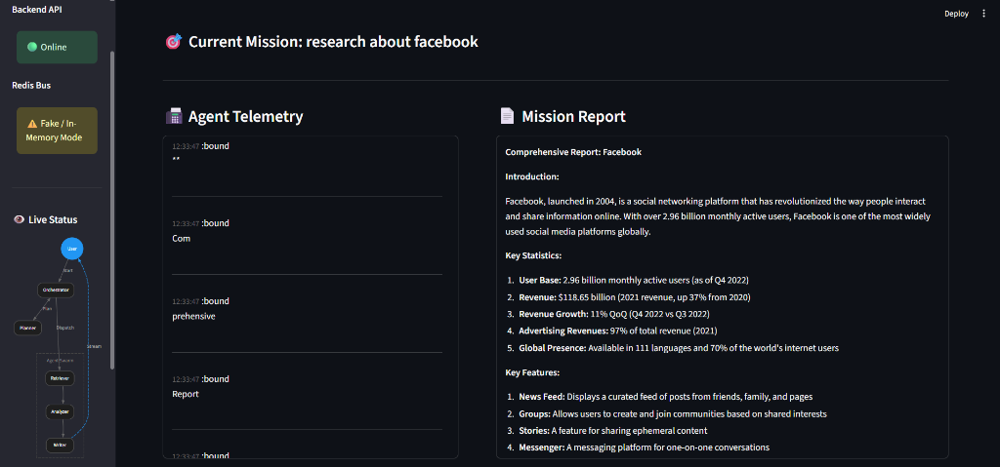

# Agentic AI System for Multi Tasks



An advanced multi-agent AI system designed to plan, execute, and stream complex tasks with resilience and reliability.

## System Architecture

### Task Lifecycle
1.  **Submit**: User POSTs a request (`/task`).
2.  **Plan**: `PlannerAgent` decomposes request into steps.
3.  **Dispatch**: `Orchestrator` pushes steps to Redis Streams (`queue:retriever`, `queue:writer`).
4.  **Execute**: Async workers consume messages independently (Manual Batching).
5.  **Stream**: Real-time updates (Status, Partial Output, Errors) pushed to user via SSE.

### Technical Highlights
-   **Explicit Agent Boundaries**: Dedicated worker modules (`retriever_worker.py`, etc.).
-   **Cognitive Layer (Groq)**: Optional LLM integration for Planner (reasoning) and Writer (streaming), with automatic deterministic fallback.
-   **Resilience**: `BaseWorker` handles retries (exponential backoff) and dead-letters.
-   **Streaming**: `WriterWorker` emits tokens character-by-character.
-   **Testing**: Auto-fallback to `fakeredis` (in-memory) if Redis needs to be mocked.

## Requirements

- Docker (recommended) OR Python 3.9+ and Redis
- (Optional) Groq API Key

## 🚀 Quick Start with Docker (Recommended)

Run the entire system (Redis + Backend + Frontend) with a single command:

```bash
docker-compose up --build
```

Access the application:
- **Frontend Dashboard**: [http://localhost:8501](http://localhost:8501)
- **Backend API Docs**: [http://localhost:8000/docs](http://localhost:8000/docs)

> **Note**: This setup uses a production-grade Docker configuration where services communicate over an internal network.

## Configuration

To enable the cognitive layer (LLMs), set the environment variable in `.env` (or pass to Docker):

```bash
GROQ_API_KEY=gsk_...
USE_GROQ=true
```
Groq is preferred but optional. The system always produces output, even when running fully offline.

If these are missing, the system automatically runs in **Deterministic Mode** (Mock Logic).

## Local Development (Without Docker)

1.  **Install dependencies**:
    ```bash
    pip install -r requirements.txt
    ```

2.  **Start Redis** (System falls back to `fakeredis` if missing, but real Redis is better):
    ```bash
    # Ensure Redis is running locally on port 6379
    ```

3.  **Run the Server**:
    ```bash
    python -m uvicorn app.main:app --reload
    ```
    (Runs at `http://localhost:8000`)

4.  **Run the UI**:
    ```bash
    python -m streamlit run ui/app.py
    ```
    (Opens at `http://localhost:8501`)

## Testing & Verification

Integration tests verify the entire flow including failure handling.

```bash
python tests/integration_test.py
```

## Architecture

See `docs/system_design.md` for detailed architecture diagrams.
