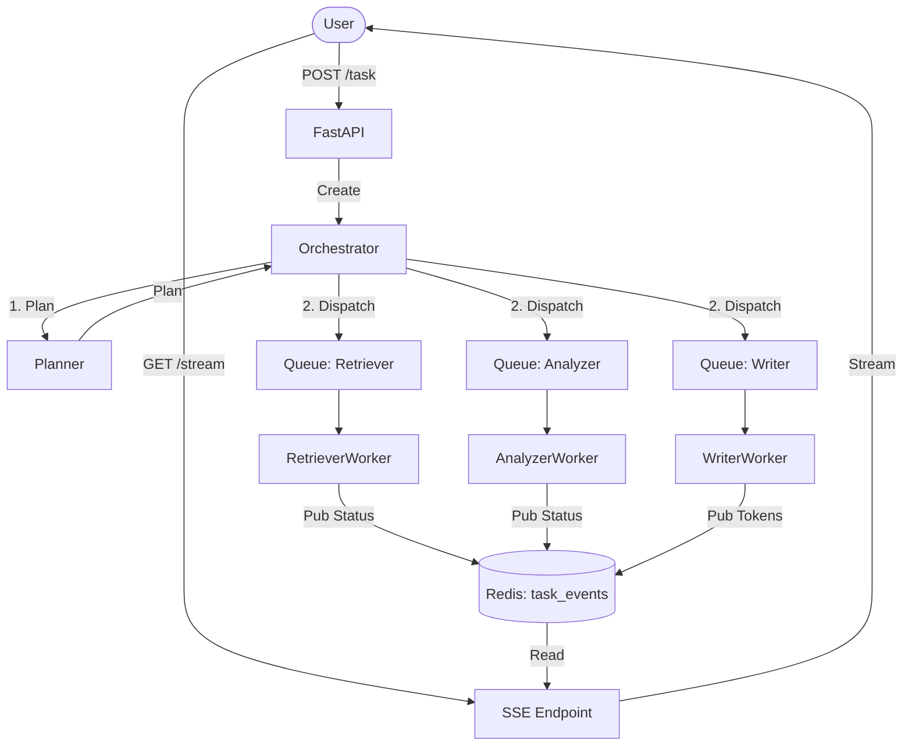

# System Architecture & Design

## 1. High-Level Architecture

The **Antigravity** system is an Event-Driven Agentic AI platform designed for robustness, scalability, and real-time user feedback. It relies heavily on **Redis Streams** for both inter-agent communication and user streaming.

### Core Components

1.  **API Layer (FastAPI)**:
    *   `POST /task`: Accepts user requests, generates a Task ID.
    *   `GET /stream/{task_id}`: Streams events to the user via Server-Sent Events (SSE).

2.  **Event Bus (Redis Streams)**:
    *   `task_events:{task_id}`: The *Single Source of Truth* for task progress. All agents publish status, errors, and partial output here. The SSE endpoint consumes this stream.
    *   `queue:{agent_name}`: Dedicated work queues for each agent type (Retriever, Analyzer, Writer).
3.  **Orchestration Layer**:
    *   **Planner**: Decomposes the user request into discrete steps (mock LLM for now).
    *   **Orchestrator**: deterministic state machine that executes the plan by dispatching steps to agent queues.

4.  **Agent Workers (Async)**:
    *   Autonomous background workers that consume from their specific `queue:{agent_name}`.
    *   **Retriever**: Simulates fetching data.
    *   **Analyzer**: Simulates reasoning.
    *   **Writer**: Streams AI responses token-by-token. Supports Hybrid Mode (Groq LLM -> Fallback to Mock).
    *   **Resilience**: Built-in retry logic (max 3 retries) with exponential backoff.

### Cognitive Layer (New in Phase 6)

The system is designed with a **Resilient-First** approach to AI integration:
1.  **Priority**: If `USE_GROQ=true`, agents (`Planner`, `Writer`) attempt to use the LLM for high-quality reasoning and generation.
2.  **Safety Net**: If the LLM fails (network, auth, timeout), agents in-flight **immediately switch** to deterministic mock logic.
3.  **Guarantee**: Output is *always* produced. The system never halts due to cognitive component failure. Groq is treated as a cognitive layer, not infrastructure.

### Data Flow



## 2. Frontend Architecture (New in Phase 7)

The system now features a **Professional Streamlit Dashboard** (`ui/app.py`) that serves as the command center.

### State Management (The "Accumulate & Persist" Pattern)
To handle Streamlit's re-run model and the ephemeral nature of SSE streams, the UI relies heavily on `st.session_state`:
*   **Final Output Persistence**: We do not rely on the stream to "paint" the screen directly. Instead, every `PARTIAL_OUTPUT` chunk is appended to `st.session_state.final_output`. The UI *always* renders this state variable. This ensures that even if the stream disconnects or the user refreshes, the intelligence report remains visible.
*   **Task Continuity**: `st.session_state.task_id` locks the UI into "Execution Mode" until explicitly reset.

### Live Visualization
*   **Vertical Flow**: A Graphviz diagram in the sidebar visualizes the `User -> Orchestrator -> Agents` hierarchy.
*   **Active State Highlighting**: The UI maps the current backend event (e.g., "Dispatching to Retriever") to a specific node in the graph, highlighting it green in real-time.

## 3. File Structure & Responsibilities

```text
Agentic AI System for Multi Tasks/
├── app/
│   ├── main.py                  # Entry point. Manages lifecycle (startup/shutdown).
│   ├── api/routes.py            # FastAPI routes for /task and /stream.
│   ├── core/orchestrator.py     # Task workflow manager.
│   ├── agents/                  # Planner, Retriever, Analyzer, Writer.
│   ├── queue/redis_client.py    # Redis Wrapper (XADD/XREAD).
│   └── streaming/sse.py         # SSE Generator.
├── ui/
│   ├── app.py                   # Main Streamlit Dashboard.
│   ├── api.py                   # Frontend -> Backend HTTP client.
│   ├── stream.py                # SSE Consumption Client.
│   └── utils.py                 # UI Helpers (Timestamp, Formatting).
├── docs/                        # System Design & Post Mortems.
├── tests/                       # Integration Tests.
└── requirements.txt             # Dependencies.
```

## 3. Resilience Strategy

*   **Retry Logic**: Implemented in `BaseWorker`. If an agent fails, it catches the exception, sleeps (backoff), and re-queues the message with `retry_count += 1`.
*   **Dead Letter**: If retries > 3, the step is marked as failed (Dead Letter) to prevent infinite loops.
*   **Fake Redis**: The system automatically switches to `fakeredis` (in-memory) if a real Redis server is not found, ensuring testability in any environment.

## 4. Manual Batching Strategy

The system implements **Manual Batching** via Redis Streams, intentionally avoiding auto-batching frameworks (like Celery or BullMQ) to demonstrate low-level control:

*   **Single-Message Consumption**: Each worker's loop (`BaseWorker.run`) explicitly reads **1 message at a time** (`count=1`) via `xread`.
*   **Backpressure**: Flow control is handled naturally by the worker's processing speed. If the orchestrator dispatches faster than workers can process, messages buffer in the Redis Stream.
*   **No Black Boxes**: Logic for fetching, processing, and acknowledging is explicitly written in Python, not hidden behind a library abstraction.

## 5. Why This Design Matches the Assignment

*   **Agent Boundaries**: Each agent (`Retriever`, `Analyzer`, `Writer`) is isolated in its own module, sharing only the `BaseWorker` infrastructure.
*   **Async Orchestration**: The Orchestrator uses a "fire-and-forget" pattern, dispatching to streams without blocking.
*   **Explicit Failure Handling**: Retries are visible events (`ERROR` type), not silent internal loops.
*   **Scalability**: New worker instances can be spun up (Docker containers) to consume from the same Redis consumer group (future enhancement) without code changes.

## 6. Docker Containerization (Phase 8)

The system is fully containerized for production-grade deployment over a strict Docker Network.

### Services Stack
1.  **Redis (`redis:7-alpine`)**:
    *   Exposes port `6379` internally to the network `agentic-net`.
    *   No host-side port binding required for internal communication.

2.  **Backend (`app/main.py`)**:
    *   Depends on `redis`.
    *   Connects via internal DNS `redis://redis:6379`.
    *   Exposes port `8000` to host for API access.

3.  **Frontend (`ui/app.py`)**:
    *   Depends on `backend`.
    *   Connects to Backend via internal DNS `http://backend:8000` (server-side calls) or `http://localhost:8000` (browser-side JS calls).
    *   Exposes port `8501` to host for User Interface.

This "Stack" approach ensures that the environment is consistent across all machines (Windows/Linux/Mac) and eliminates "works on my machine" issues related to Redis installation or Python versions.
